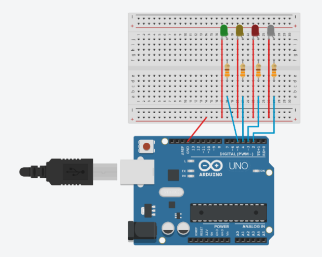

# controlando-arduino-por-voz
Script simples em python para controlar LEDs conectados ao arduino através de comandos de voz. Para isso basta seguir as seguintes configurações:

### No arduino:
Primeiro, monte fisicamente o arduino conforme a imagem:




Depois, acesse a IDE do Arduino para compilar e enviar o exemplo `StandardFirmata` presente em: `Arquivo > Exemplos > Firmata > StandardFirmata`.
> OBS: Verifique a porta onde o computador de somunica com o arduino, pois tal porta será requisitada no script em python.

### No computador:
Instale as seguintes bibliotecas:
```bash
pip install SpeechRecognition
pip install spacy
pip install pyfirmata
```
E coloque a porta no qual seu computador está conectando com o arduino (neste exemplo, estou usando a porta COM4)
```
board = Arduino('COM4')
```
### Agora é só se divertir!
Execute o script em python falando os comandos e as cores.

### Referências:
- Programando Arduino em Python [PyFirmata] https://www.linkedin.com/pulse/programando-arduino-em-python-pyfirmata-wellington-c-faria
- Reconhecimento de Voz com Python: Faça seu primeiro Olá Mundo com Speech Recognition! https://medium.com/@suzana.svm/reconhecimento-voz-python-35a5023767ca
- Brincando de Processamento Natural de Linguagem com spaCy https://leportella.com/pt-br/2017/11/30/brincando-de-nlp-com-spacy.html
